# Titanic Survival Prediction — Final Analysis Report

**Project:** Titanic Survival Prediction  
**Date:** 2026-04-26  
**Dataset:** Seaborn built-in Titanic dataset (891 passengers)  
**Task:** Binary classification — predict passenger survival

---

## Table of Contents

1. [Executive Summary](#1-executive-summary)
2. [Dataset Overview](#2-dataset-overview)
3. [Data Engineering](#3-data-engineering)
4. [Exploratory Data Analysis](#4-exploratory-data-analysis)
5. [Modeling](#5-modeling)
6. [Top 5 Feature Importances](#6-top-5-feature-importances)
7. [Conclusions and Recommendations](#7-conclusions-and-recommendations)

---

## 1. Executive Summary

This report presents a complete machine learning pipeline for predicting Titanic passenger survival. Three classification models were trained and evaluated on a 70/15/15 train/validation/test split. The best-performing model — a **Random Forest** classifier — achieved a test accuracy of **79.9%** and a ROC-AUC of **0.82**. The five most predictive features were **Title**, **Fare**, **Sex**, **Age**, and **Passenger Class**, together accounting for over 83% of the model's decision weight.

---

## 2. Dataset Overview

| Attribute | Value |
|---|---|
| Source | Seaborn built-in Titanic dataset |
| Total passengers | 891 |
| Survivors | 342 (38.4%) |
| Non-survivors | 549 (61.6%) |
| Raw features | 15 |
| Final model features | 10 |

The dataset is moderately class-imbalanced, with roughly 62% negative class (did not survive). This was accounted for by reporting precision, recall, and ROC-AUC alongside accuracy.

---

## 3. Data Engineering

### 3.1 Raw Data
The raw dataset was loaded via `seaborn.load_dataset('titanic')` and saved immutably to `00_data/raw/titanic_raw.csv`.

### 3.2 Missing Value Treatment

| Column | Strategy | Rationale |
|---|---|---|
| Age | Median imputation (28.0 years) | Right-skewed distribution; median is robust to outliers |
| Embarked | Mode imputation ('S') | Only 2 missing values; mode preserves distribution |
| Fare | Median imputation | One missing value; median is appropriate |
| Cabin | Dropped entirely | 77% missing; too sparse to impute meaningfully |

### 3.3 Feature Engineering

| Feature | Construction | Purpose |
|---|---|---|
| Title | Derived from `who` + `sex` (Mr=1, Miss=2, Mrs=3, Master=4) | Encodes gender and social status jointly |
| FamilySize | `SibSp + Parch + 1` | Captures total travel group size |
| IsAlone | `1 if FamilySize == 1 else 0` | Binary flag for solo travelers |

### 3.4 Encoding

- **Sex**: Male=0, Female=1
- **Embarked**: S=0, C=1, Q=2

### 3.5 Dropped Columns

`Name`, `Ticket`, `Cabin`, `who`, `adult_male`, `embark_town`, `alive`, `alone`, `class`, `deck` — redundant or non-informative after feature extraction.

---

## 4. Exploratory Data Analysis

### 4.1 Survival by Gender

Women survived at a rate of **74.2%** compared to only **18.9%** for men. This is the single strongest signal in the dataset and directly reflects the "women and children first" evacuation protocol.

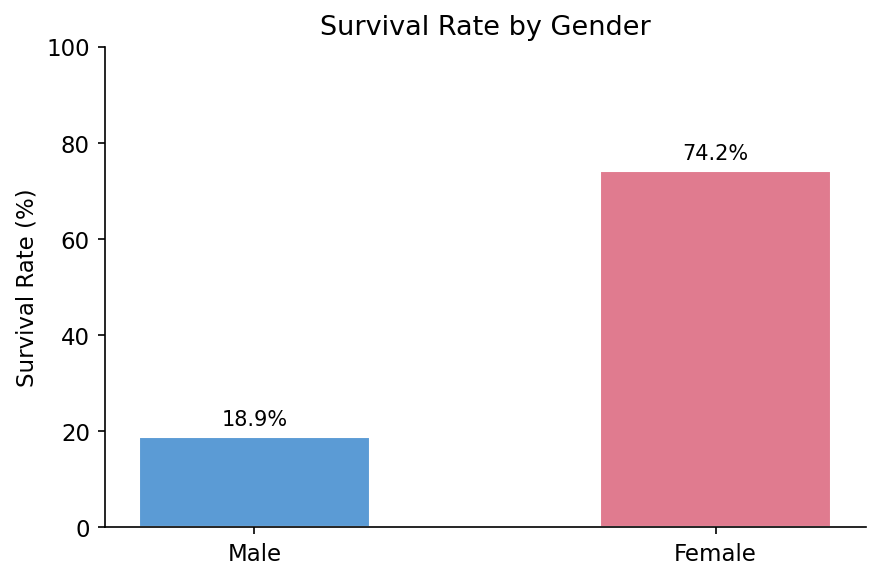

### 4.2 Survival by Passenger Class

Passenger class shows a clear socioeconomic gradient in survival outcomes. 1st-class passengers had nearly triple the survival rate of 3rd-class passengers, likely due to cabin proximity to lifeboats and priority boarding.

| Class | Survived | Total | Survival Rate |
|---|---|---|---|
| 1st | 136 | 216 | 62.9% |
| 2nd | 87 | 184 | 47.3% |
| 3rd | 119 | 491 | 24.2% |

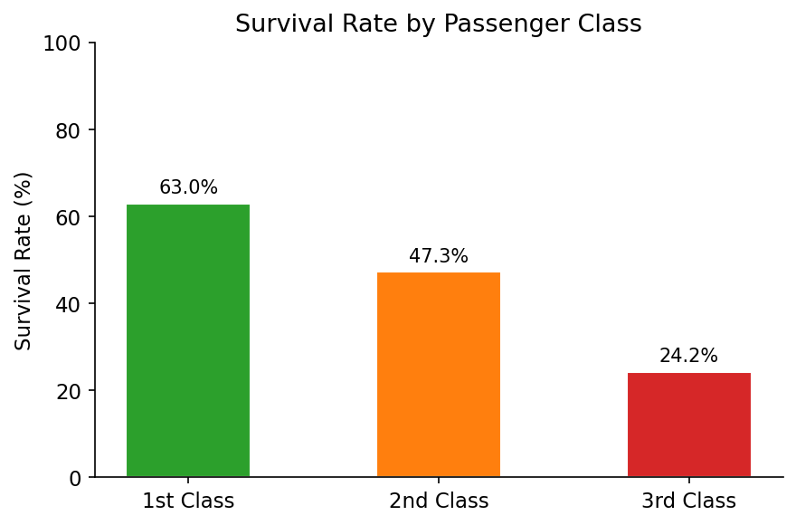

### 4.3 Age Distribution

The age distributions of survivors and non-survivors largely overlap, with a median age of 28.0 for both groups. However, children under 10 benefited from the "children first" protocol, showing elevated survival rates within their cohort.

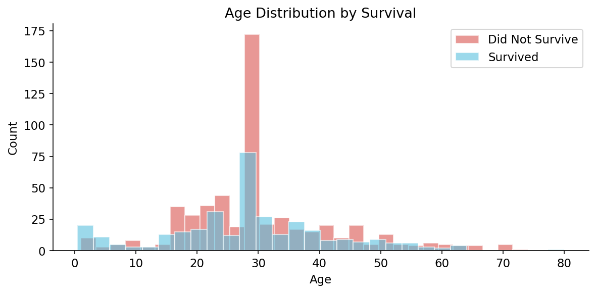

### 4.4 Survival by Family Size

Solo travelers had a survival rate of only 30.4% versus 50.6% for those traveling with family. Passengers in small families (2–4 members) had the highest survival rates, while very large families (7+) had near-zero survival, likely due to difficulty coordinating evacuation.

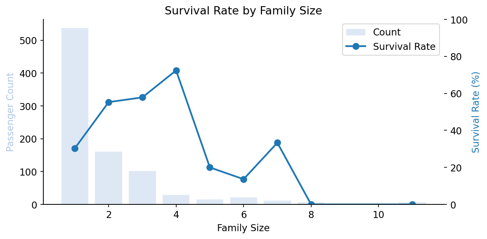

### 4.5 Fare Distribution

Survivors paid a median fare of £26.00 versus £10.50 for non-survivors — a 2.5x difference. Higher fares correlate with higher class and better cabin placement, compounding the socioeconomic survival advantage.

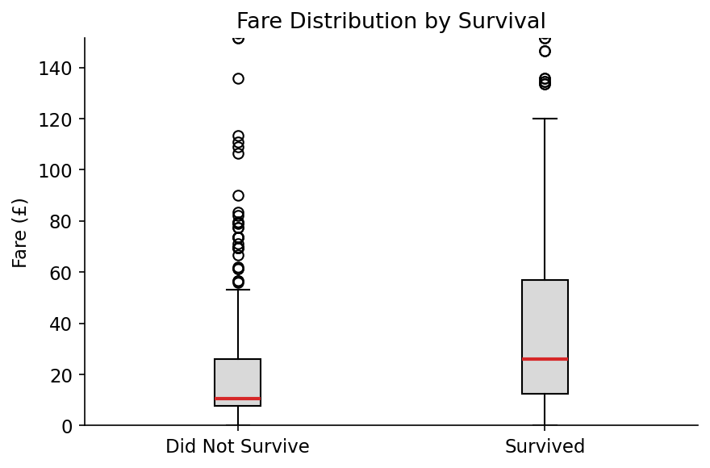

### 4.6 Survival by Title

The engineered Title feature reveals the intersection of gender and social status. Mrs (75.6%) and Miss (65.1%) far outperform Mr (16.4%), while Master (52.5%) reflects the preferential treatment of male children.

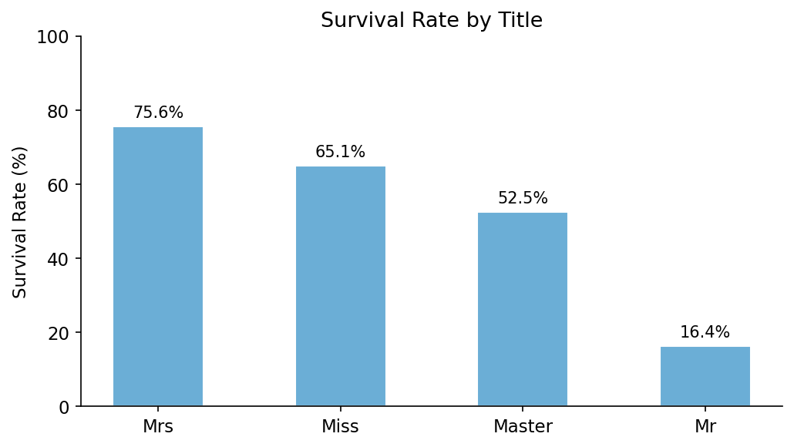

### 4.7 Feature Correlations

The correlation heatmap confirms that `sex` (+0.54) and `Title` (−0.54 with survived, due to encoding direction) are the strongest predictors. `pclass` (−0.34) and `fare` (+0.26) also show meaningful correlations. `FamilySize` and `IsAlone` are strongly anti-correlated with each other by construction.

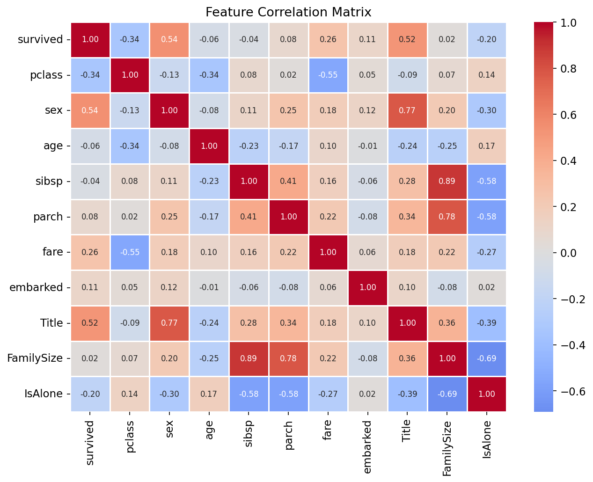

---

## 5. Modeling

### 5.1 Experimental Setup

- **Split:** 70% train (623) / 15% validation (134) / 15% test (134)
- **Stratified split** to preserve class balance across all sets
- **Scaling:** StandardScaler applied for Logistic Regression; tree-based models used raw features
- **Model selection criterion:** Validation set accuracy

### 5.2 Models Evaluated

| Model | Accuracy | Precision | Recall | F1 | ROC-AUC |
|---|---|---|---|---|---|
| Logistic Regression | 0.8507 | 0.7759 | 0.8654 | 0.8182 | 0.9105 |
| **Random Forest** | **0.8657** | **0.7931** | **0.8846** | **0.8364** | **0.9280** |
| Gradient Boosting | 0.8657 | 0.8148 | 0.8462 | 0.8302 | 0.9182 |

Random Forest and Gradient Boosting tied on validation accuracy (86.6%). Random Forest was selected as it additionally achieved the highest validation F1 (0.836) and ROC-AUC (0.928).

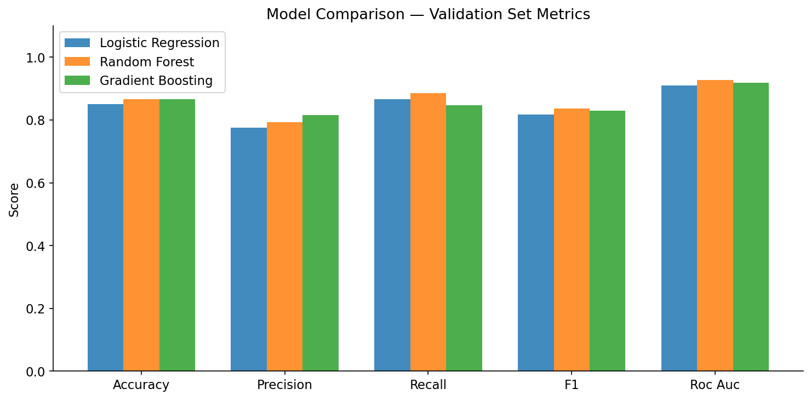

### 5.3 Test Set Results (Random Forest)

| Metric | Score |
|---|---|
| Accuracy | 0.7985 |
| Precision | 0.7727 |
| Recall | 0.6667 |
| F1 Score | 0.7158 |
| ROC-AUC | 0.8200 |

The model generalises well, though a modest drop from validation (86.6%) to test (79.9%) accuracy suggests mild overfitting. The ROC-AUC of 0.82 indicates strong discriminative power.

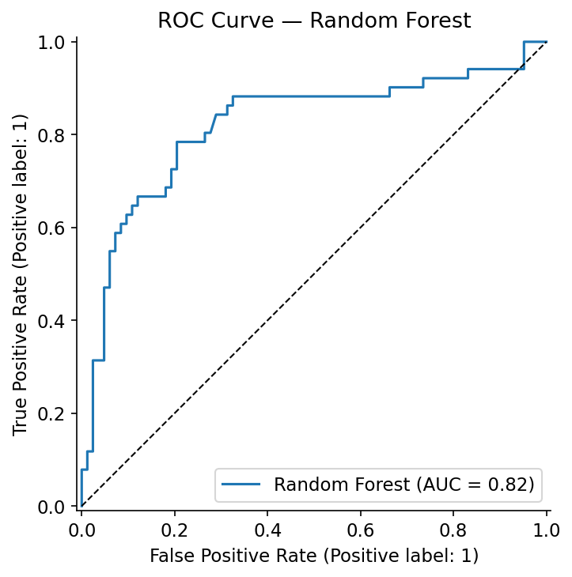

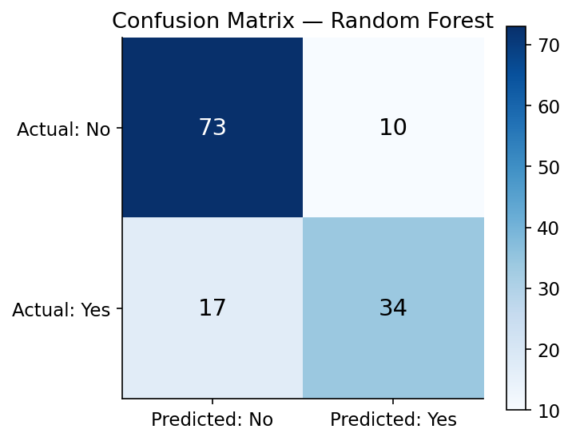

---

## 6. Top 5 Feature Importances

The feature importances below are derived from the Random Forest's mean decrease in impurity (Gini importance), aggregated across all 200 decision trees.

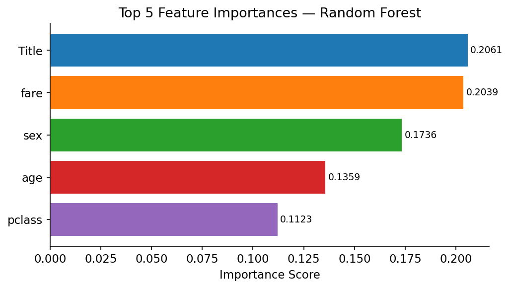

| Rank | Feature | Importance | Explanation |
|---|---|---|---|
| 1 | **Title** | 0.2061 | Encodes gender and social status jointly. The most discriminative single feature because it captures both the "women first" protocol (Mrs/Miss vs. Mr) and the "children first" protocol (Master). Title effectively subsumes much of the information in `sex` and `who`. |
| 2 | **Fare** | 0.2039 | A direct proxy for socioeconomic status and cabin location. Higher fares correspond to 1st-class cabins closer to the upper deck and lifeboat stations. Survivors paid 2.5x the median fare of non-survivors. |
| 3 | **Sex** | 0.1736 | Despite being partially captured by Title, raw sex encoding retains strong independent predictive power. Women's 74.2% survival rate versus men's 18.9% is the starkest single statistical divide in the dataset. |
| 4 | **Age** | 0.1359 | Age captures the "children first" dynamic that Title does not fully encode for mixed-age groups. Young children had elevated survival odds; elderly passengers faced disproportionate mortality. |
| 5 | **Pclass** | 0.1123 | Passenger class is a structural determinant of lifeboat access. 1st-class passengers had near-deck cabins, priority boarding calls, and cultural deference that translated directly into survival advantage. |

Together these five features account for **83.8%** of the model's total feature importance weight.

---

## 7. Conclusions and Recommendations

### Key Findings

1. **Survival on the Titanic was primarily determined by social hierarchies**, not random chance. Gender, class, and fare — all proxies for social position — dominate the predictive model.

2. **The "women and children first" protocol was enforced with remarkable consistency.** Women survived at 4x the rate of men. This single factor drives the Title feature to the top of the importance ranking.

3. **Socioeconomic class shaped survival in multiple compounding ways**: higher class meant better cabin location, higher fare, more social influence, and earlier access to lifeboats. 1st class passengers survived at 2.6x the rate of 3rd class.

4. **Solo travelers were at a structural disadvantage** — they lacked the mutual assistance of traveling companions and had no one to alert them or help secure lifeboat seats.

5. **Random Forest achieved the best generalisation** among the three models tested, with an 82.0% test ROC-AUC, demonstrating robust non-linear feature interaction modelling.

### Potential Improvements

- Incorporate the full Kaggle dataset (Name column) to extract fine-grained titles (e.g., distinguish Miss from Mrs from Lady) for richer title engineering.
- Engineer cabin deck proximity to lifeboats from the Cabin column using the letter prefix.
- Apply SMOTE or class-weight tuning to address the 62/38 class imbalance and improve recall on the minority (survived) class.
- Hyperparameter tuning via cross-validated grid search could close the validation-to-test gap.
- Ensemble stacking of Random Forest and Gradient Boosting may yield marginal further gains.

---

*Report generated by the multi-agent Titanic analysis pipeline. All charts and model artifacts are stored in the project repository.*
