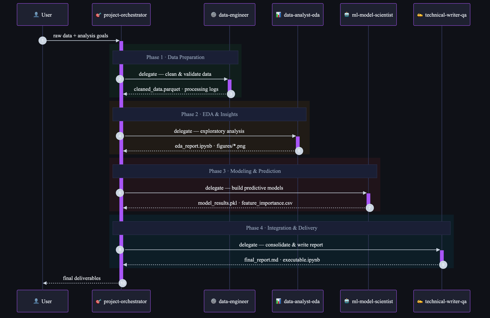

# Titanic Survival Prediction

## Project Overview
Binary classification analysis to predict Titanic passenger survival using machine learning.

## Objective
Build predictive models to identify which passengers survived the Titanic disaster, and generate an analysis report explaining the top 5 most important features.

## Methodology
- Train/Validation/Test split: 70% / 15% / 15%
- Models evaluated: Logistic Regression, Random Forest, Gradient Boosting
- Best model selected by validation accuracy
- Final evaluation on held-out test set

## Directory Structure
- `00_data/raw/` — Immutable raw data (titanic_raw.csv)
- `00_data/processed/` — Cleaned and engineered features (titanic_cleaned.parquet)
- `00_data/intermediate/` — Intermediate processing artifacts
- `01_notebooks/exploratory/` — EDA notebooks
- `01_notebooks/modeling/` — Model development notebooks
- `01_notebooks/final/` — Final executable notebook
- `02_src/` — Reusable Python modules
- `03_reports/figures/` — Saved chart images
- `04_models/` — Serialized trained models

## Deliverables
- `03_reports/final_report.md` — Comprehensive analysis report
- `01_notebooks/final/executable_titanic_analysis.ipynb` — End-to-end executable notebook

## Multi-Agent Pipeline Architecture

The analysis was produced by a sequential multi-agent pipeline orchestrated by `project-orchestrator`.

| Agent | Role | Key Output |
|---|---|---|
| **project-orchestrator** | Plans the pipeline and delegates all tasks | Task briefs, coordination |
| **data-engineer** | Cleans raw data and engineers features | `cleaned_data.parquet` |
| **data-analyst-eda** | Exploratory analysis, statistics, visualisations | `eda_report.ipynb`, charts |
| **ml-model-scientist** | Trains models, identifies key parameters | `model_results.pkl`, feature importance |
| **technical-writer-qa** | Integrates all outputs, final QA | `final_report.md`, `executable.ipynb` |

## Date
2026-04-26